<p align="center">
  <a href="https://isaiahchonchoramirez.github.io/isaiahramirezdev/">
    
  </a>
</p>

<h3 align="center">Data Engineering · Human-Centered AI · Full-Stack Development</h3>

<p align="center">
  I turn messy data, complex systems, and human-centered ideas into practical, polished software.
</p>

<p align="center">
  <a href="https://isaiahchonchoramirez.github.io/isaiahramirezdev/"></a>
  <a href="https://www.linkedin.com/in/isaiah-ramirez-dev/"></a>
  <a href="mailto:izzyrmrz@umich.edu"></a>
</p>

---

## About me

I’m **Isaiah Ramirez**, an Information Analysis student at the **University of Michigan** building at the intersection of **data engineering**, **human-centered AI**, and **full-stack development**.

I enjoy turning complex ideas and unruly datasets into useful, accessible software—from AI-powered search and analytics platforms to interactive 3D experiences and responsive full-stack applications.

- Building AI-assisted search, retrieval, and knowledge systems
- Exploring data pipelines, analytics, and visualization
- Designing accessible, human-centered products
- Creating interactive experiences with React, Three.js, and WebGL
- Shipping fast APIs, clean data models, and practical developer tools

## Selected work

<details open>
  <summary><strong>Flagship products — eight projects, one click away</strong></summary>
  <br />
  <table>
    <tr>
      <td width="25%" valign="top">
        <a href="https://isaiahchonchoramirez.github.io/isaiahramirezdev/tesseraxis/index.html">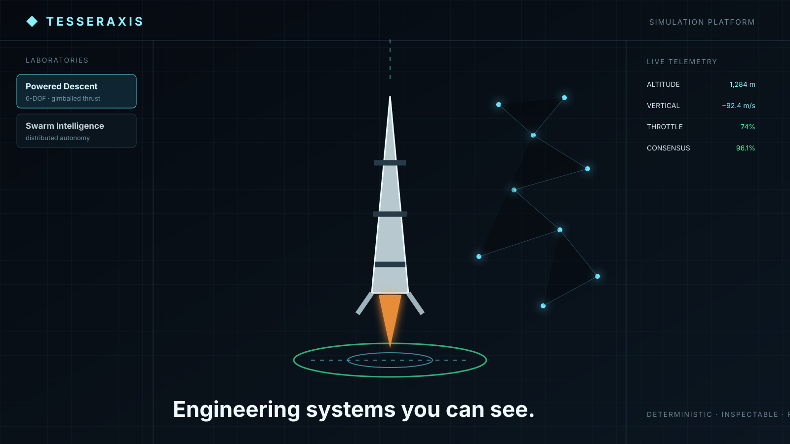</a>
        <h3>Tesseraxis</h3>
        <p>Inspectable engineering simulations: rockets, swarms, vehicles, and deterministic replay.</p>
        <a href="https://isaiahchonchoramirez.github.io/isaiahramirezdev/tesseraxis/index.html">Live demo ↗</a> · <a href="https://github.com/Isaiahchonchoramirez/isaiahramirezdev/tree/main/public/tesseraxis">Code</a>
      </td>
      <td width="25%" valign="top">
        <a href="https://isaiahchonchoramirez.github.io/isaiahramirezdev/trade-assistant/index.html">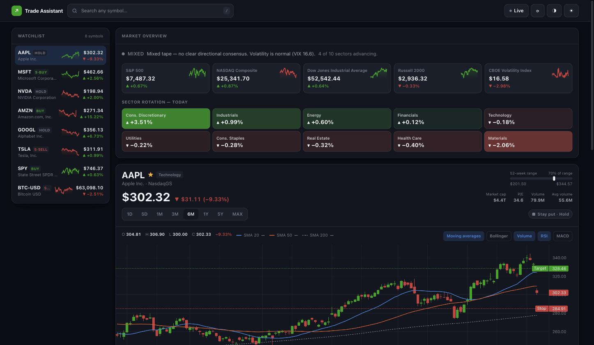</a>
        <h3>AI Trade Assistant</h3>
        <p>Explainable market signals and lookahead-safe backtests, with a free local download.</p>
        <a href="https://isaiahchonchoramirez.github.io/isaiahramirezdev/trade-assistant/index.html">Live demo ↗</a> · <a href="https://github.com/Isaiahchonchoramirez/ai-trade-assistant">Code</a>
      </td>
      <td width="25%" valign="top">
        <a href="https://isaiahchonchoramirez.github.io/isaiahramirezdev/lyrx/index.html">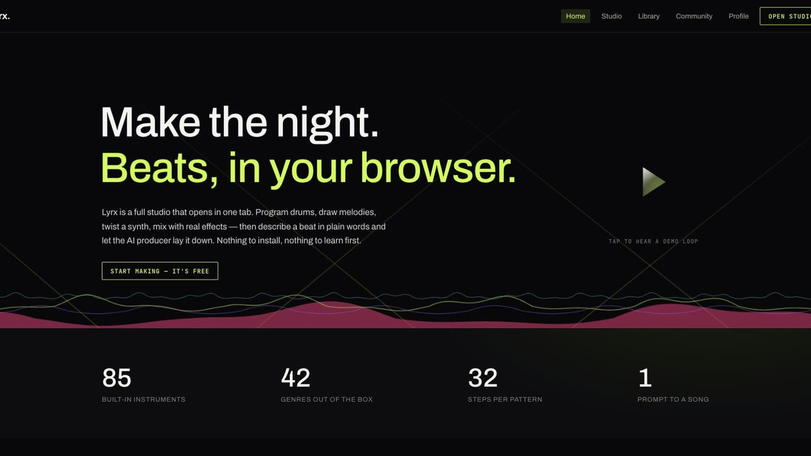</a>
        <h3>Lyrx</h3>
        <p>A full browser music studio with synths, sequencer, AI producer, and WAV export.</p>
        <a href="https://isaiahchonchoramirez.github.io/isaiahramirezdev/lyrx/index.html">Live demo ↗</a> · <a href="https://github.com/Isaiahchonchoramirez/isaiahramirezdev/tree/main/public/lyrx">Code</a>
      </td>
      <td width="25%" valign="top">
        <a href="https://isaiahchonchoramirez.github.io/isaiahramirezdev/datacore/index.html">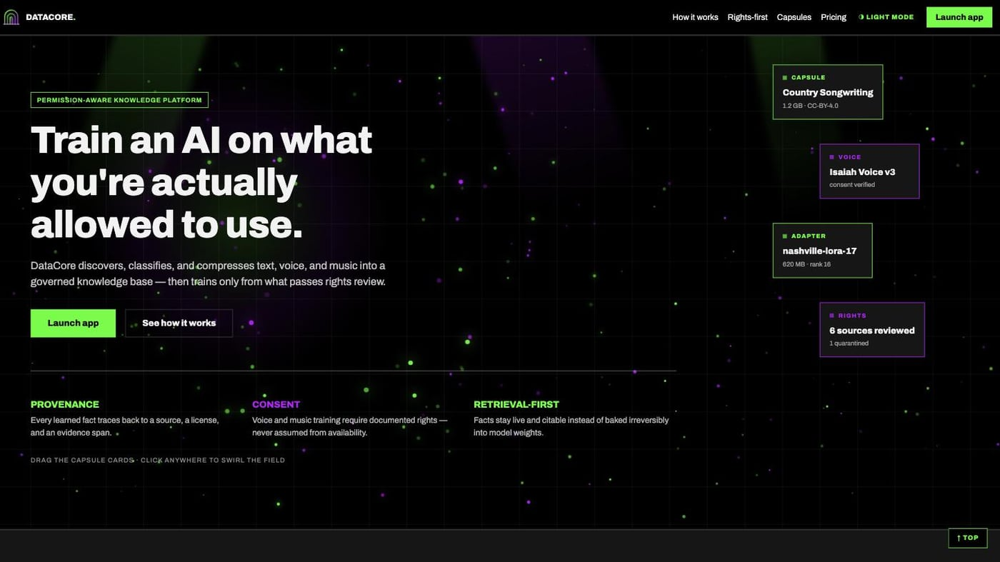</a>
        <h3>DataCore</h3>
        <p>A rights-aware data pipeline with consent gates, classification, and removal audit trails.</p>
        <a href="https://isaiahchonchoramirez.github.io/isaiahramirezdev/datacore/index.html">Live demo ↗</a> · <a href="https://github.com/Isaiahchonchoramirez/isaiahramirezdev/tree/main/public/datacore">Code</a>
      </td>
    </tr>
    <tr>
      <td width="25%" valign="top">
        <a href="https://isaiahchonchoramirez.github.io/isaiahramirezdev/datagate/index.html">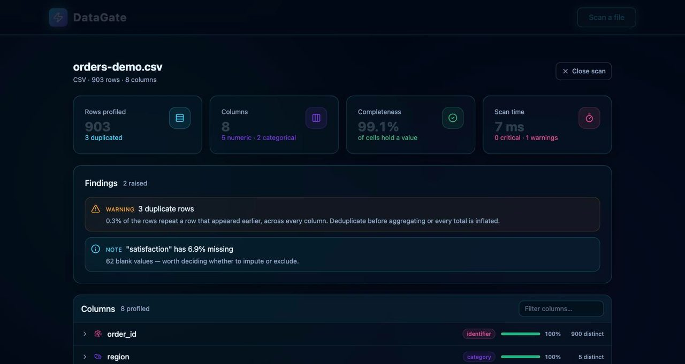</a>
        <h3>DataGate</h3>
        <p>A browser-native profiler for CSV, TSV, JSON, and JSONL files. Nothing is uploaded.</p>
        <a href="https://isaiahchonchoramirez.github.io/isaiahramirezdev/datagate/index.html">Live demo ↗</a> · <a href="https://github.com/Isaiahchonchoramirez/isaiahramirezdev/tree/main/projects/datagate">Code</a> · <a href="https://github.com/Isaiahchonchoramirez/isaiahramirezdev/blob/main/projects/datagate/README.md">README</a>
      </td>
      <td width="25%" valign="top">
        <a href="https://isaiahchonchoramirez.github.io/isaiahramirezdev/unwritten-age/index.html">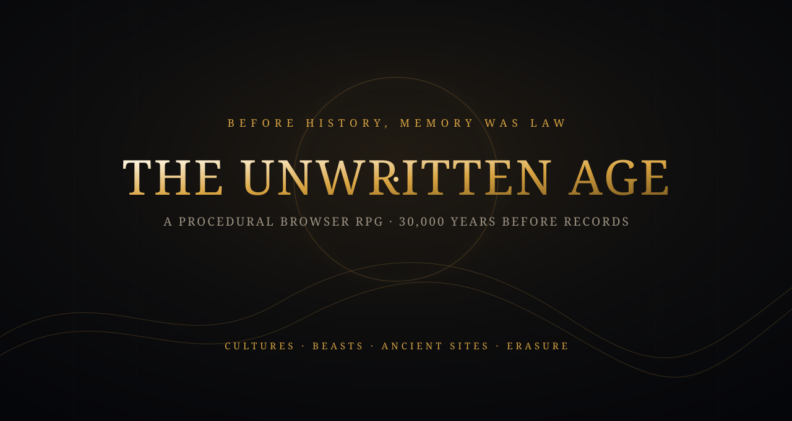</a>
        <h3>The Unwritten Age</h3>
        <p>A procedural 3D RPG where defeating a god erases them from history.</p>
        <a href="https://isaiahchonchoramirez.github.io/isaiahramirezdev/unwritten-age/index.html">Enter the world ↗</a> · <a href="https://github.com/Isaiahchonchoramirez/isaiahramirezdev/tree/main/public/unwritten-age">Code</a>
      </td>
      <td width="25%" valign="top">
        <a href="https://isaiahchonchoramirez.github.io/isaiahramirezdev/rave/index.html">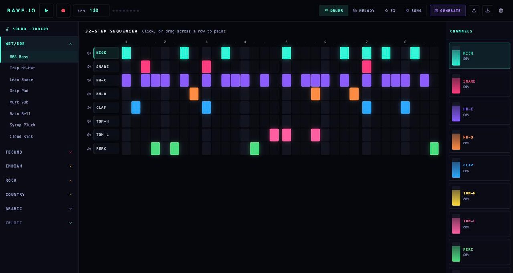</a>
        <h3>RAVE.IO</h3>
        <p>A beat machine with synthesized instruments, genre-aware patterns, and WAV rendering.</p>
        <a href="https://isaiahchonchoramirez.github.io/isaiahramirezdev/rave/index.html">Live demo ↗</a> · <a href="https://github.com/Isaiahchonchoramirez/isaiahramirezdev/tree/main/projects/rave-io">Code</a> · <a href="https://github.com/Isaiahchonchoramirez/isaiahramirezdev/blob/main/projects/rave-io/README.md">README</a>
      </td>
      <td width="25%" valign="top">
        <a href="https://isaiahchonchoramirez.github.io/isaiahramirezdev/blom/index.html">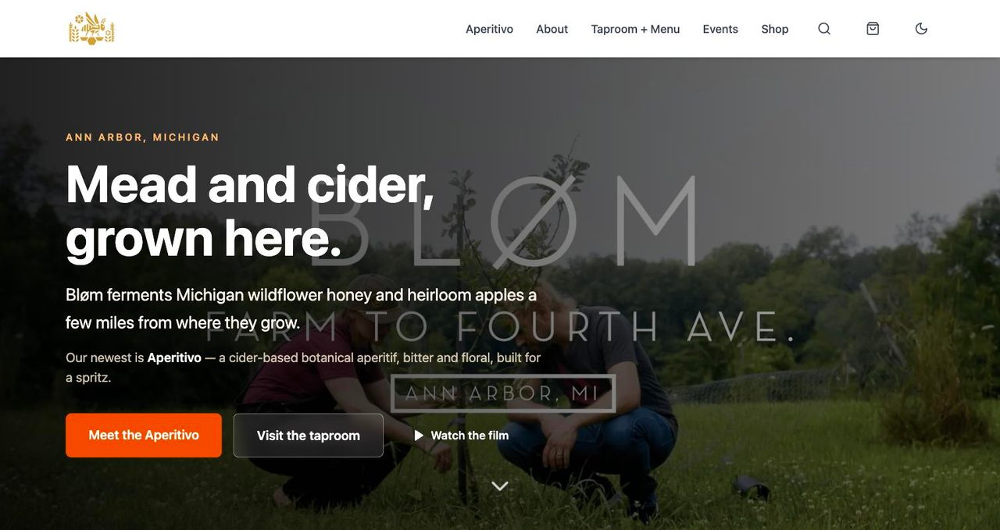</a>
        <h3>Bløm</h3>
        <p>A working Michigan mead and cider storefront with search, shop, events, and cart flows.</p>
        <a href="https://isaiahchonchoramirez.github.io/isaiahramirezdev/blom/index.html">Live demo ↗</a> · <a href="https://github.com/Isaiahchonchoramirez/isaiahramirezdev/tree/main/projects/blom-redesign">Code</a> · <a href="https://github.com/Isaiahchonchoramirez/isaiahramirezdev/blob/main/projects/blom-redesign/README.md">README</a>
      </td>
    </tr>
  </table>
  <p align="center"><a href="https://isaiahchonchoramirez.github.io/isaiahramirezdev/#/projects"><strong>Explore the full project directory →</strong></a></p>
</details>

<details>
  <summary><strong>3D modeling, animation, and visual studies</strong></summary>
  <br />
  <table>
    <tr>
      <td width="25%">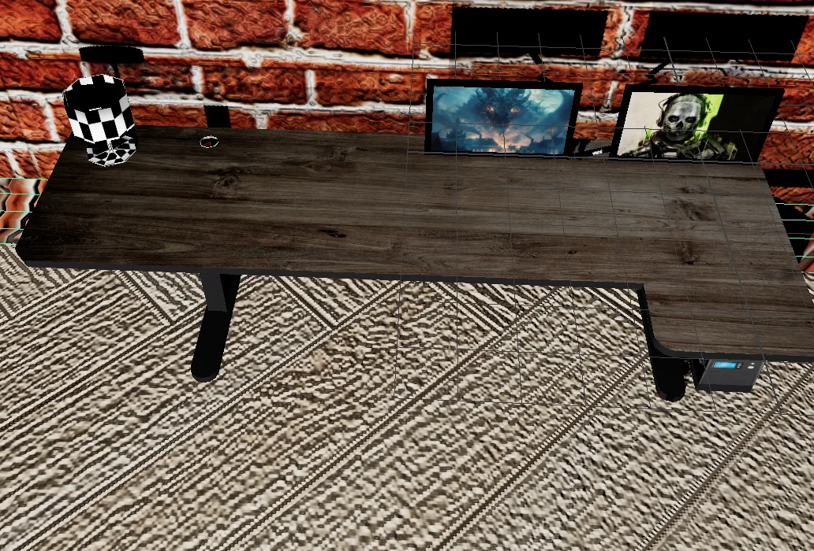<br /><sub><strong>Workstation environment</strong><br />Room, desk, monitors, materials, and lighting.</sub></td>
      <td width="25%">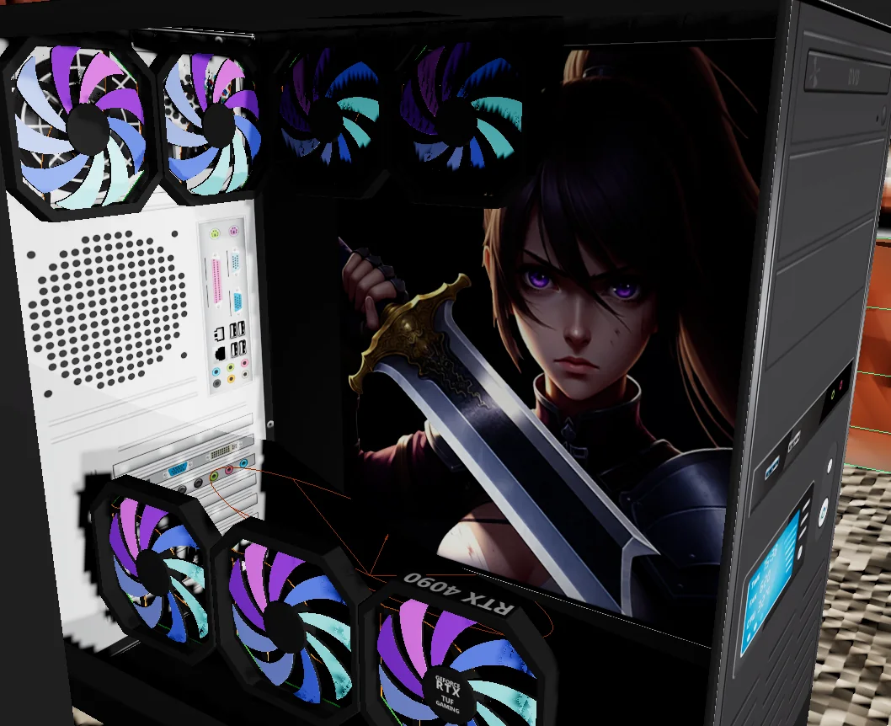<br /><sub><strong>Tower + cooling system</strong><br />Hard-surface modeling, UVs, materials, and animated fans.</sub></td>
      <td width="25%">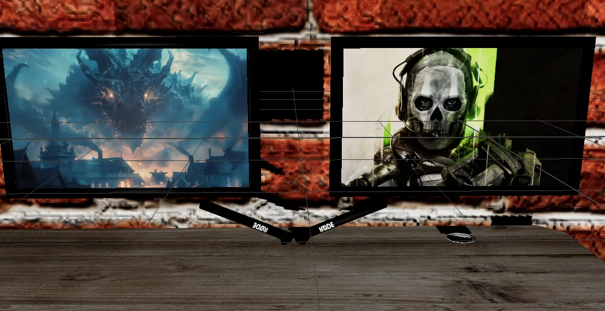<br /><sub><strong>Dual-monitor setup</strong><br />Display materials, mic arm, brick wall, and set dressing.</sub></td>
      <td width="25%"><br /><sub><strong>Pizza Pete</strong><br />Stylized character modeling, texture design, and materials.</sub></td>
    </tr>
  </table>
  <p align="center">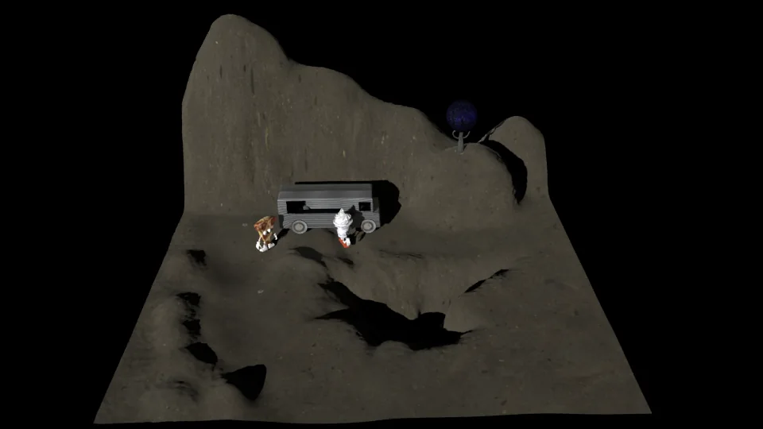<br /><sub><strong>Outdoor scene study</strong> · terrain, taco truck, characters, and environment composition</sub></p>
  <p align="center"><a href="https://github.com/Isaiahchonchoramirez/isaiahramirezdev/tree/main/public/images/projects/maya"><strong>See the full Maya gallery →</strong></a></p>
</details>

<details>
  <summary><strong>Analysis, modeling, and research projects</strong></summary>
  <br />
  <table>
    <tr><td><strong>Sports Forecast Engine</strong><br />Dependency-free C++20 Poisson model with chronological holdout evaluation. <a href="https://github.com/Isaiahchonchoramirez/isaiahramirezdev/blob/main/projects/sports-forecast-engine/README.md">README ↗</a></td><td><strong>Michigan Lead-Risk Analysis</strong><br />83-county public-health join across housing, water, and childhood EBLL indicators. <a href="https://isaiahchonchoramirez.github.io/isaiahramirezdev/#michigan-lead-risk">Case study ↗</a></td></tr>
    <tr><td><strong>Occupy Space</strong><br />Normalized NASA NEO + APOD pipeline with SQLite storage and hazard analysis. <a href="https://isaiahchonchoramirez.github.io/isaiahramirezdev/#occupy-space">Case study ↗</a></td><td><strong>Crop-Yield Efficiency</strong><br />Irrigation, fertilizer, rainfall efficiency, and tested crop-relative comparisons. <a href="https://isaiahchonchoramirez.github.io/isaiahramirezdev/#crop-yield">Case study ↗</a></td></tr>
    <tr><td><strong>Networks, Homophily &amp; Polarization</strong><br />Three real networks plus 1,000-node simulations of closure mechanisms. <a href="https://isaiahchonchoramirez.github.io/isaiahramirezdev/#network-polarization">Case study ↗</a></td><td><strong>Mapping Lansing’s HOLC Grades</strong><br />Area-weighted historical redlining audit using projected spatial boundaries. <a href="https://isaiahchonchoramirez.github.io/isaiahramirezdev/#lansing-redlining">Case study ↗</a></td></tr>
  </table>
  <p align="center"><a href="https://isaiahchonchoramirez.github.io/isaiahramirezdev/#projects"><strong>Browse the portfolio case studies →</strong></a></p>
</details>

## Featured work

| Focus | What I build | Toolkit |
|---|---|---|
| **AI search systems** | Search and retrieval tools for structured and unstructured information | Python, FastAPI, SQL, embeddings, React |
| **Data platforms** | Workflows for cleaning, analyzing, and visualizing data | Python, Pandas, NumPy, SQL, Plotly |
| **Interactive 3D web** | Browser-based worlds and motion-driven interfaces | Three.js, WebGL, React, Vite |
| **Full-stack applications** | Responsive products with APIs, authentication, and production-ready UI | React, Node.js, FastAPI, PostgreSQL |
| **Agricultural analytics** | Yield analysis and outlier detection through statistical visualization | Python, SQL, data visualization |

## Core stack

Tools I’ve used across shipped products, coursework, experiments, and portfolio builds:

**Languages & data systems**

<p></p>

<p>
  
  
  
  
</p>

**Application development & APIs**

<p></p>

<p>
  
  
  
</p>

**Data, AI & scientific computing**

<p></p>

<p>
  
  
  
  
  
  
</p>

**Infrastructure, cloud & delivery**

<p></p>

<p>
  
  
  
</p>

**Games, 3D, audio & animation**

<p></p>

<p>
  
  
  
</p>

**Design, motion & product tools**

<p></p>

<p>
  
  
  
</p>

```text
Readable code      Useful data products      Accessible interfaces
Fast iteration     Human-centered AI         Clean visual systems
```

<details>
  <summary><strong>GitHub activity</strong></summary>
  <br />
  <p align="center">
    
    
  </p>
  <p align="center">
    
  </p>
</details>

<p align="center">
  
</p>
